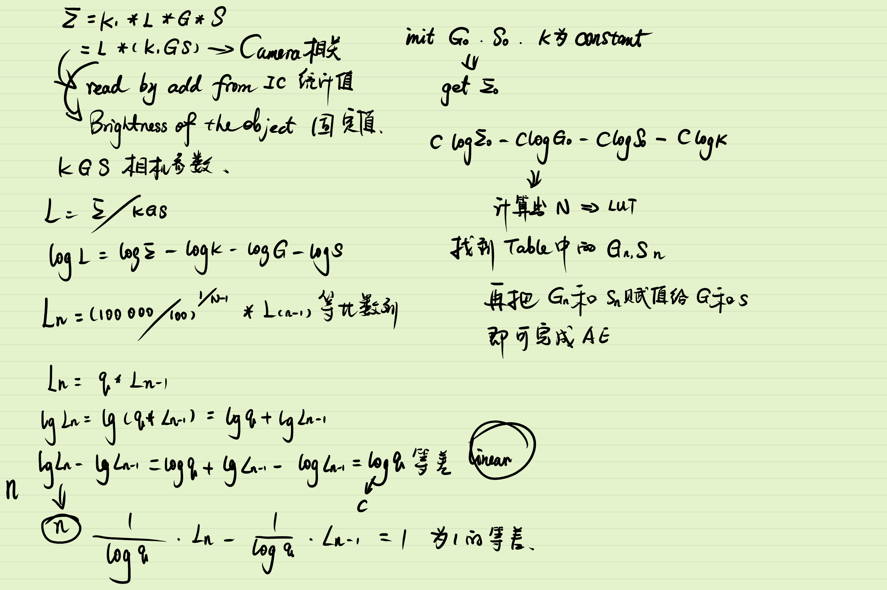

# 3A算法——AE(auto exposure)

## 预实验公式+LUT法

### 算法说明

这篇论文给出的AE算法其实很简单，根据以下公式
$$
\begin{gather}
\Sigma=k 1 \times L \times G \times S \tag{1}
\end{gather}
$$
∑为ISP芯片内的统计值，可以通过读取寄存器地址直接获取，L为当前物体的亮度，G为gain值，S为曝光时间。

变换以下公式：
$$
\begin{gather}
L=\Sigma /(k 1 \times G \times S) \tag{2}
\end{gather}
$$
L是当前物体的亮度，当环境不发生变化时这个是一个定值。那么思路就很简单了，初始化的时候先给定一组GS，K为常数，然后通过寄存器读出∑的值就可以计算出L，然后通过前期试验找出不同L对应的最佳GS参数组合，然后通过LUT找到这种参数组合，重新赋值给GS即可完成曝光。

具体流程如图

同时该论文中设定L的取值范围是100Lx—100000Lx之间，这么大的范围如果一个一个测试台费时间却赵勇内存过大，所以作者就将这个范围分成一个等比数列
$$
\begin{gather}
L n=(100000 / 100)^{I /(N-1)} \times L_{(n-1)} \tag{3}
\end{gather}
$$
N为设计的地址的个数，根据这个数目将这个范围分成一个等比数列。然后进一步为了简化运算，将公式(1)取对数
$$
\begin{gather}
\log L=\log \Sigma-\log S-\log G-\log k 1 \tag{4}
\end{gather}
$$
因为Ln是等比数列，那么$\log L$ 就是等差数列，那么${L_{(n)} - L_{(n-1)}} / q$ 就是一个等差为1的等差数列，就正好设计为LUT的地址，这样用一个数组就科一解决（q为等比数列的公比）。

具体推导过程如图手稿

### 参考文献 

《A NEW AUTOMATIC EXPOSURE SYSTEM FOR DIGITAL STILL CAMERAS 》（Tetsuya Kuno, Hiroaki Sugiura ...）

## 公式+LUT+微调法

### 算法说明

该算法的主要流程如下流程图

流程很简单，就是通过初始化参数获取图像，然后用过测光得到图像的平均亮度，然后根据LUT找到对应调整步伐，然后判断该步伐是否超过最大步伐，如果超过则使用最大步伐调整，调整后平均亮度理论上应该接近目标亮度，所以调整后就可以通过微调进一步优化。

该算法的重点就是如何建立内建表。
$$
\mathrm{AE}_{\mathrm{step}}=\left(1 / \mathrm{E}_{\mathrm{Step}}\right) * \log _{2}\left(\mathrm{~T}_{Y} / \mathrm{Y}_{\mathrm{ave}}\right)
$$
论文中提出通过如上公式建立内建表，这个公式按照理解应该也是通过大量实验得到的。下面对公式做解释：

- $\mathrm{AE}_{\mathrm{step}}$ : 所需要调整的步阶数；
- $\mathrm{E}_{\mathrm{Step}}$ : 调整曝光时间的最小单位，这个值对于同一设备是常亮；
- $\mathrm{~T}_{Y}$ : 所需要的的目标亮度；
- $\mathrm{Y}_{\mathrm{ave}}$ : 画面的平均亮度；

具体做法是，八位数据两说亮度值就是0-255,0不能最分母，而且一般也不会拍摄亮度为0的画面，所以内建表就设计为1-255，然后根据设置的target的值计算出每一个平均亮度对应的$\mathrm{AE}_{\mathrm{step}}$ ，当相机计算出平均亮度就立马能找到对应的步伐进行调整，从而完成曝光任务。

论文中设置的母亮度为128建立以一个内建表，但是这个方法的弊端就在于目标亮度不同就会得建立不同的内建表，如果需要更新目标亮度就得更新整张表，如果建立多张表的话对于内存大小又有要求。

### 参考文献

《数位相机的自动曝光的方法》 刑开诚

## 公式快速带入法

### 算法说明

利用这种方法最重要的就是求出公式，一般求公式的方式也是通过实验获取一些输入，然后通过机器学或者其他方式拟合出一条曲线，最后根据曲线方程计算出相应的参数。
$$
Y=M\left(1-e^{-\frac{KGX}{M}}\right)
$$
该论文中主要通过以上公式建立，公式参数说明如下;

- Y: 表示成像器获取的图像亮度
- M：表示成像器所能获取的最高图像亮度值；
- K: 表示曝光时间为1个单位时间，即最小步长是成像器获取的图像亮度；
- G: 表示电子增益；
- x: 表示曝光时间；

算法的具体操作步骤如下：

1. 通过初始化参数G1, T1即可获取该参数下的图像亮度Y1；就有$Y_{1}=M\left(1-e^{-\frac{KG_{1}T_{1}}{M}}\right)$
2. 那么对于目标亮度$Y_{target}$就有对应的参数G2和T2,同理瞒住公式：$Y_{target}=M\left(1-e^{-\frac{KG_{2}T_{2}}{M}}\right)$
3. 对上面两公式化简可得：$\frac{\ln \left(M-Y_{1}\right)-\ln (M)}{\ln \left(M-Y_{target}\right)-\ln (M)}=\frac{G_{1} T_{1}}{G_{2} T_{2}}$
4. 进一步归纳公式： $\frac{(\ln \left(M-Y_{target}\right)-\ln (M))G_{1} T_{1}}{\ln \left(M-Y_{1}\right)-\ln (M)}={G_{2} T_{2}}$
5. 公式左侧$M$, $Y_{target}$, $Y_{1}$, $G_{1}$, $T_{1}$ 均为已知，那么新的曝光参数的乘积就是一个已知量
6. 论文中给出的方式就是先确定一个$G_{2}$ 值，然后根据公式求出$T_{2}$ 的值，然后对求出来的值取整，得到最终的$T_{2}$
7. 根据最终的$T_{2}$ 的值再反过来求出$G_{2}$ 的值；，而且

整个算法大概的流程就是这样，理论上只需一帧就可以调整到合适曝光参数。对于第6步中先确定的$G_{2}$ 的值来说，因为增加gain对增加信息量没有作用，而且通过gain值增加亮度还会导致噪声变大，所以这篇论文中给出gain的取值范围为1-2，所以对于第六步其实可以默认$G_{2}$ 为1，然后求出一个T，然后判断T是否超过最大曝光时间，如果没有就继续上面的步骤，如果超过了既可以用最大曝光时间算出一个gain，然后判断这个gain时候超过2，如果没有就确定了一组参数，如果超过就取gain为2接着计算T也能得到一组新的参数。

具体的算法流程可以总结为以下方式

### 参考文献

《一种自动曝光实现方法》 游明琦，刘勇

